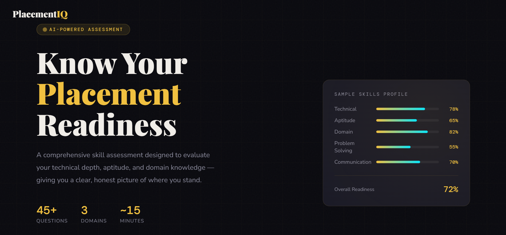
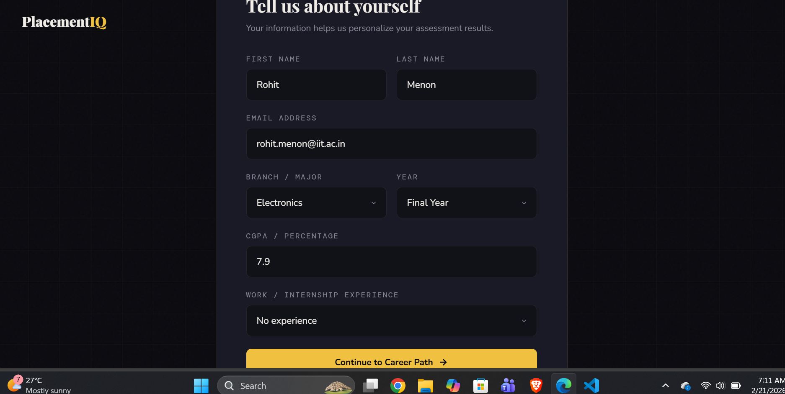
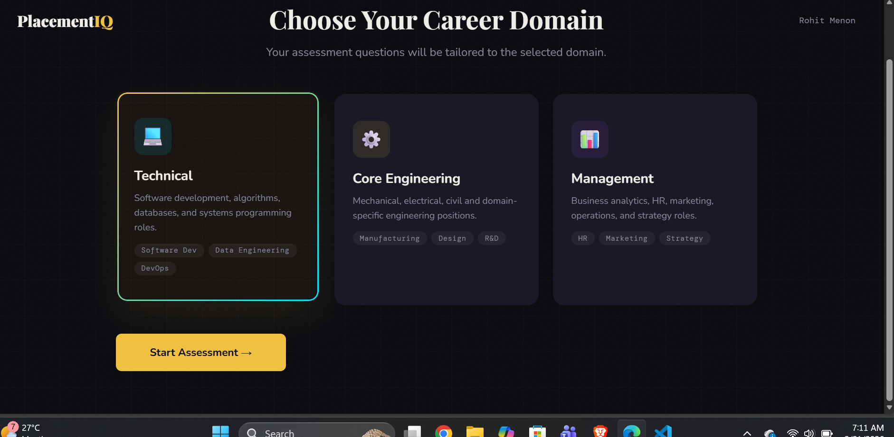
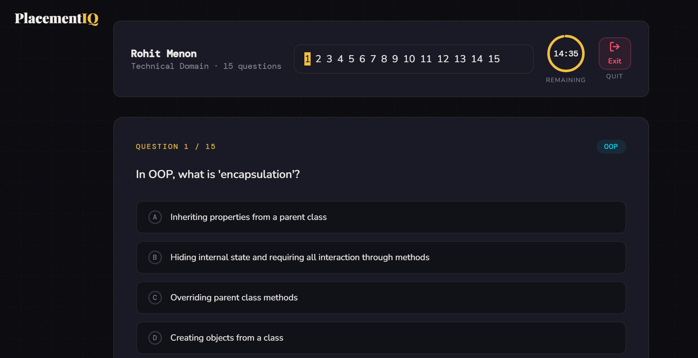

<p align="center">
  
</p>

# PLACEMENTIQ 🎯

## Basic Details

### Team Name: TIRAMISU

### Team Members
- Member 1: DEVIPRIYA P - LBS INSTITUTE OF TECHNOLOGY FOR WOMEN
- Member 2: KALYANI M G - LBS INSTITUTE OF TECHNOLOGY FOR WOMEN

### Hosted Project Link
[mention your project hosted link here]

### Project Description
PlacementIQ is an AI-inspired, browser-based career readiness assessment platform that evaluates students across domain knowledge, quantitative aptitude, academic performance, and experience — delivering an instant, personalized placement readiness report. Built as a zero-dependency single-file web app, it features a multi-step onboarding flow, 45+ curated questions across Technical, Core Engineering, and Management tracks, a live-timed assessment engine, and actionable score-driven recommendations. Designed to bridge the gap between academic preparation and industry expectations, PlacementIQ empowers students to identify their strengths, address skill gaps, and walk into placements with confidence.

### The Problem statement
Every year, thousands of students enter campus placement season underprepared — not because they lack potential, but because they have no clear, objective measure of where they actually stand. Most students rely on gut feeling or peer comparison to gauge their readiness, often discovering critical skill gaps only after failing interviews. Existing solutions are either too generic, paywalled, or require institutional access, leaving the majority of students without a reliable self-assessment tool. There is no unified, accessible platform that evaluates a student's domain knowledge, aptitude, academic profile, and experience together — and translates that into honest, actionable feedback before it's too late.

### The Solution
PlacementIQ gives students instant, objective clarity on their placement readiness through a structured assessment covering domain knowledge, aptitude, academics, and experience — delivering a scored report with a clear readiness tier and actionable recommendations, completely free and browser-based.

It also connects colleges and recruiters into the loop. Placement cells get batch-wide analytics to intervene early, while recruiters get a lightweight pre-screening signal to surface prepared candidates faster.

**Students get direction. Colleges get intelligence. Recruiters get better talent.**

---

## Technical Details

### Technologies/Components Used

**For Software:**
- Languages used: HTML,CSS,JAVASCRIPT
- Frameworks used: NONE
- Libraries used: Google Fonts (Playfair Display, DM Mono, Nunito) for typography
- Tools used:  VS Code, Git,Chatgpt

**For Hardware:**
- Main components:Any device with a modern web browser (desktop, tablet, or mobile)
- Specifications: No minimum hardware requirements — lightweight single-file app with no backend, no database, and no installation

- Tools required:A browser (Chrome, Firefox, Edge, Safari)

---

## Features

List the key features of your project:
- Feature 1: Domain-Specific Assessment: Students choose from Technical, Core Engineering, or Management tracks — each with a curated question bank of 15+ domain questions and 10 aptitude questions, randomly shuffled every attempt to ensure a fresh experience.
- Feature 2: Smart Scoring Engine: Results are computed across four parameters — domain accuracy, aptitude performance, CGPA, and work experience — producing a weighted readiness score, a clear tier (Placement Ready / Developing / Needs Work), and personalized improvement recommendations.
- Feature 3: Live Timed Assessment: A 15-minute countdown with a visual ring timer, question navigation palette, answered/unanswered tracking, and a confirmation-gated exit button — replicating the pressure and structure of a real placement test.
- Feature 4: College-Student-Recruiter Ecosystem: Designed to scale beyond individual use — placement cells can track batch-wide readiness and intervene early, while recruiters can use scores as a pre-screening signal to identify job-ready candidates faster.

---

## Implementation
No installation required.
### For Software:

#### Installation
```bash
[Installation commands - e.g., npm install, pip install -r requirements.txt]
```

#### Run

Open placement_assessment.html in any modern web browser.

### For Hardware:

#### Components Required
[List all components needed with specifications]

#### Circuit Setup
[Explain how to set up the circuit]

---

## Project Documentation

### For Software:

#### Screenshots (Add at least 3)
## 📸 Screenshots

### 1️⃣ screenshot1.png – Home Page

**Description:** This is the home page of the PlacementIQ application showing the main dashboard and navigation menu.

---

### 2️⃣ screenshot2.png – Student Dashboard

**Description:** Displays student details, placement status, and available job opportunities.

---

### 3️⃣ screenshot3.png – Company Listings

**Description:** Shows the list of companies participating in placements along with eligibility criteria.

---

### 4️⃣ screenshot5.png – Admin Panel

**Description:** Admin interface for managing students, companies, and placement records.

#### Diagrams

**System Architecture:**


*Explain your system architecture - components, data flow, tech stack interaction*

**Application Workflow:**


*Add caption explaining your workflow*

---


#### Build Photos


*List out all components shown*


*Explain the build steps*


*Explain the final build*

---


## Project Demo

### Video
[Add your demo video link here - YouTube, Google Drive, etc.]

*Explain what the video demonstrates - key features, user flow, technical highlights*

### Additional Demos
[Add any extra demo materials/links - Live site, APK download, online demo, etc.]

---

## AI Tools Used (Optional - For Transparency Bonus)
**Tool Used:** Claude AI
**Purpose:** [What you used it for]
- Example: "Generated boilerplate React components"
- Example: "Debugging assistance for async functions"
- Example: "Code review and optimization suggestions"

**Key Prompts Used:**
-"Complete the app with a new UI, functionality, validations and implement dummy data. Store as many questions as you can in memory."
- "Add an exit button while doing the assessment"
- "Maintaining all current fields, add confirmation modal on exit"

**Percentage of AI-generated code:** Approximately 50%

**Human Contributions:**
- Ideation & Architectures.
- Design & UX Decisions
- Content & Logic Design 
- Testing & Iteration


---

## Team Contributions

- Devipriya P — Project ideation, problem statement definition, product architecture design, UI/UX decisions, frontend development, and application testing across browsers and edge cases.
- Kalyani M G — Domain research, question bank curation and validation, scoring logic design, result tier and recommendation framework, and hackathon documentation.

---

## License

This project is licensed under the [LICENSE_NAME] License - see the [LICENSE](LICENSE) file for details.

**Common License Options:**
- MIT License (Permissive, widely used)
- Apache 2.0 (Permissive with patent grant)
- GPL v3 (Copyleft, requires derivative works to be open source)

---

Made with ❤️ at TinkerHub
